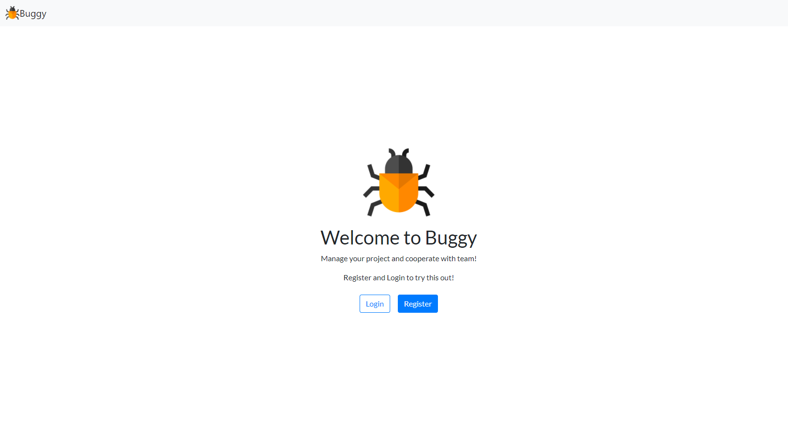

# Buggy 🐛🐛🐛

Buggy is an app to manage projects.  
It is allows you to create projects, tickets and teams around the projects.
Manage and see how the project is moving forward.  
Was inspired by Jira 🔥🔥

## How to run the app

1. Either fork or download the app an open the folder in the cli.
2. Install all dependencies suing the `npm i` command.
3. Create Firebase.js file.
4. Login/Register to Firebase
5. Create new project, new web app and copy Firebase SDK snippet.
6. Copy into Firebase.js and initialize app

<code>   export const fire = firebase.initializeApp(firebaseConfig);

   const projectStorage = firebase.storage();

   export {projectStorage};
</code>

7. Start the web server using the `npm start` command. The app will be served at http://localhost:3000/
8. Go to http://localhost:3000/ in your browser and use the app.

## Ok, but how to use it?

1. First you need to login. If you just want to try app the app go to www.buggybuggy.com to see the demo.
2. Login using test credentials:

   email: usertester@gmail.com  
   password: GoTestBuggy4Now

3. Start using the app!

## Features

- Register
- Login
- Create Project
- Update Project
- Delete Project
- See created Projects
- See projects you are involved in
- Create Issues
- Update Issues
- Delete Issues
- Invite other users to the project
- Delete other users from the project
- Update roles of the users
- Upload the avatar Photo
- Sort Tickets to pending, open, done
- Read Number of sorted Tickets

## Technologies used

- React JS
- Firebase Authentication
- Firebase Real Data Base
- Firebase Storage

## How does the App looks like?

